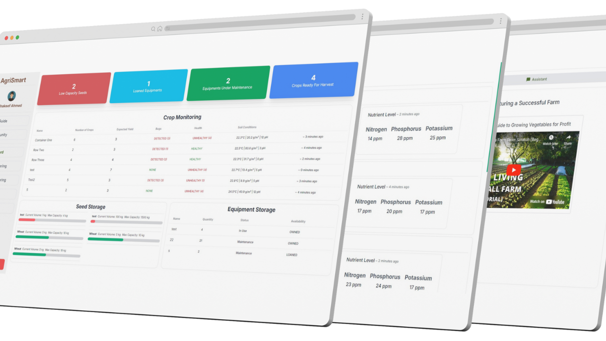

## About AgriSmart

Our team’s project, AgriSmart, made it to the Top 10 Finalists at the GDSC CRCE BitNBuild’24 Hackathon. The 24-hour challenge pushed me to test my limits, and I came away with not only a solid project but also a renewed sense of confidence in my ability to work under pressure. AgriSmart was built as a Logistics Management Platform aimed at addressing challenges in farming operations. It focused on tracking seeds, tools, and machinery to improve efficiency and productivity for farmers. We also included features like real-time tracking for stock levels, fuel status, and maintenance schedules. The project aimed to create a streamlined system for farmers to manage their resources effectively while tackling the inefficiencies in traditional farming practices.

## Key Features

We packed the platform with features that could genuinely make a difference for farmers. AgriSmart, a module within our project, provided personalized dashboards for tracking resources. Real-time data on tools, seeds, and machinery allowed farmers to stay on top of their operations. One of the standout features was the AI Agri-Guide, which used an AI model to answer farm-related questions and guide new farmers through beginner-friendly resources. We also built a community forum for farmers to connect and share knowledge, adding a collaborative aspect to the platform.

## Personal Experience

This hackathon was a turning point for me. Working under a strict 24-hour deadline was intense, but it showed me what I’m capable of. It was my first experience developing a full-stack application within such a short time, and I even managed to integrate AI into the project. What stood out most was how well our team communicated. My teammates relayed their ideas and plans, and I coded them into reality bit by bit. By the end, I had a functional platform that I was proud of, and I learned that I could handle the pressure of fast-paced development.

## What I Learned

The biggest takeaway for me wasn’t just the technical skills or the project itself—it was realizing that I could build something substantial within a limited time frame. The challenge forced me to think quickly, prioritize effectively, and trust my abilities. It also reaffirmed the importance of teamwork. Everyone brought their strengths to the table, and together we created something meaningful in just a day. I’m looking forward to taking this experience into future challenges.

AgriSmart is still in its early stages, but the potential is clear. While the hackathon is over, the experience has left me motivated to keep refining my skills and exploring new ideas. I now know that even under intense constraints, I can deliver results, and I’m excited to see where this confidence takes me.
