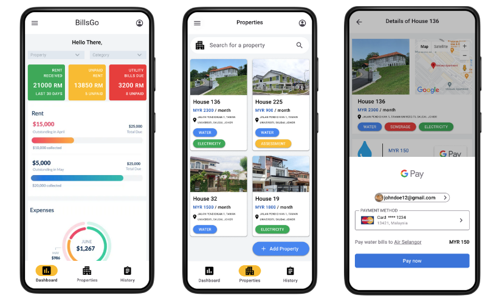
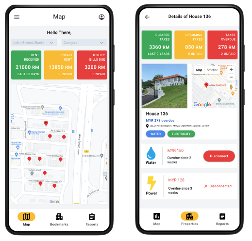

## About BillsGo

BillsGo was our utility bill payment and collection app. Users got centralized bill tracking, Google Pay support, and automatic due-date reminders; service providers got a Google Maps-integrated dashboard for visualizing overdue bills and managing service disconnection.

## My Role and Team

Adnan and I refined the project idea through brainstorming sessions, and I prepared the slide deck tying together the technical and business framing. Shimon and Dipto built the demo app for the judges. We were mentored throughout by Mr. Daren Tan, who pushed us on aligning technical solutions with user needs and on telling a compelling narrative to the judges.

## Reflections

The biggest lesson here wasn't a technical one — it was the importance of presenting a clear narrative around the technical work. The mentorship reframed how I think about user-pain mapping in early ideation.
