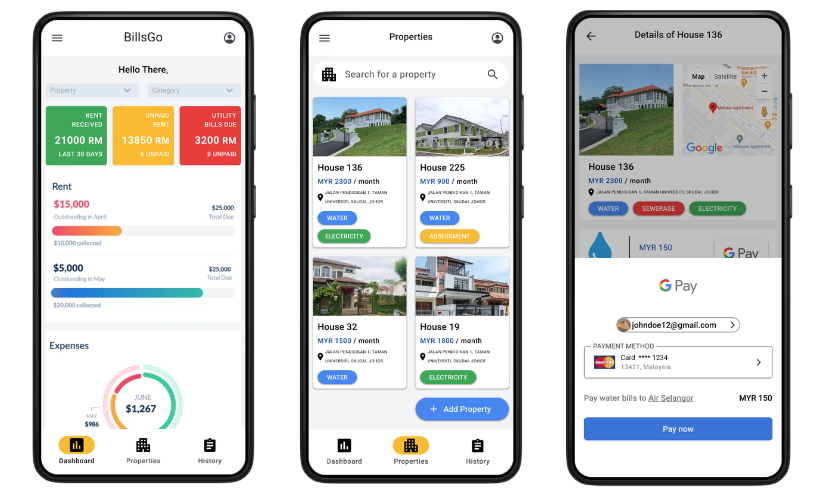

## About BillsGo

BillsGo is an all-in-one utility bill payment and collection app designed to simplify bill management for users and service providers. The app integrates features like Google Pay support, centralized bill tracking, and visualized dashboards to address inefficiencies in traditional billing systems.

## The Idea and Teamwork

The idea for BillsGo stemmed from the challenges faced by utility users and companies in managing bills and collections. Adnan and I brainstormed the project idea, refining it through discussions to address real-world problems effectively. Meanwhile, Shimon and Dipto focused on developing the demo app, ensuring it was ready to showcase to the judges. I prepared the slides to clearly present our concept, tying together the technical and business aspects of the project.

## Mentorship and Growth

Throughout the competition, Adnan and I were mentored by Mr. Daren Tan, a highly experienced hackathon participant and organizer. He provided valuable insights on ideation, business planning, and presenting ideas effectively. This mentorship helped us understand the importance of aligning technical solutions with user needs and delivering a compelling narrative. The lessons we learned from him about creating impactful presentations and clearly communicating our vision were instrumental in our success.

## Features of BillsGo

**For Users:** BillsGo offers centralized bill management, effortless payments via Google Pay, and automatic reminders for due dates. These features help users avoid late payment charges and simplify the bill management process.  
**For Service Providers:** BillsGo includes a Google Maps-integrated dashboard for visualizing overdue bills, streamlining service disconnection, and enhancing operational efficiency.

## Key Takeaways

Working on BillsGo taught us the value of teamwork, clear communication, and user-focused design. The mentorship we received emphasized the importance of addressing specific pain points with practical solutions while ensuring the project's presentation resonated with judges and stakeholders alike.

## Personal Experience

Participating in DevHack 2023 was an enriching experience. Collaborating with a diverse team and overcoming challenges reinforced the importance of adaptability and perseverance. Securing a spot among the Top 10 Finalists was a testament to our efforts and the impact of our solution.

## Looking Ahead

BillsGo, while a finalist project at DevHack 2023, has the potential to transform bill management processes for users and service providers. The recognition we received highlights the innovation and dedication of our team. Moving forward, we aim to explore ways to bring this concept to life and solve real-world challenges in the utility sector.
