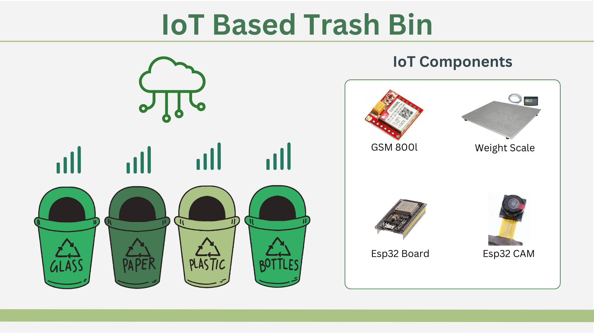
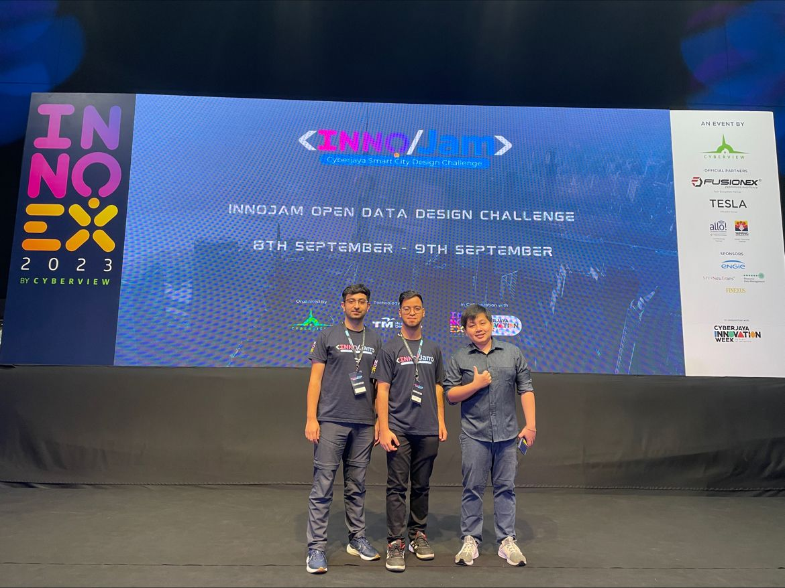

## About ReCycgo

ReCycgo is a mobile application designed to help businesses (B2B) optimize waste management. The app leverages smart logistics to monitor trash weight via connected smart dustbins, provides real-time updates to lorry drivers and waste collectors, and predicts future trash volumes using data analytics. The goal is to reduce logistical delays and improve Malaysia's recycling rate to achieve the national target of 40% by 2025.

## My Contribution

I contributed remotely to the project by brainstorming the idea with the team, preparing presentation slides, and crafting the pitch to effectively communicate our solution's vision and potential impact. My focus was on ensuring the presentation demonstrated the practical and technical aspects of ReCycgo.

## Key Insights

Malaysia loses an estimated RM476 million annually due to poor recycling practices. Our solution addresses this by combining technology and logistics to reduce landfill costs and delays in waste management. During the event, we highlighted the potential of our system to improve operational efficiency for businesses while contributing to sustainability.

## Event Experience

InnoJam 2023 was held in conjunction with InnoEx 2023 and organized by Cyberview. The event gathered participants from diverse backgrounds, including university students and professionals, to design sustainable solutions for urban challenges in Cyberjaya. Over two days, we worked on leveraging open data to envision Cyberjaya as a model Smart Sustainable City.

