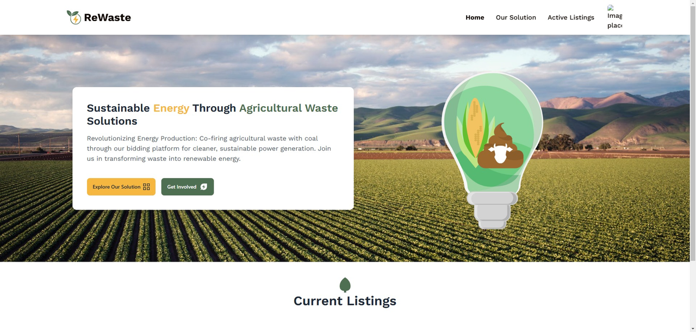

## About ReWaste

ReWaste was an innovative platform designed to tackle the underutilization of agricultural waste in Malaysia. The platform connects sellers of agricultural waste with power plant owners, enabling them to engage in a sustainable bidding process that contributes to cleaner energy production. By utilizing AI-driven tools, we streamlined the selling process, creating a win-win situation for both sellers and power plant owners.

## Our Project Idea

The core idea behind ReWaste was to create an online auction platform for agricultural waste. Sellers would put their waste up for auction where they would add listings specifying the type of waste available (e.g., coconut waste, palm oil biomass), the quantity, initial price, and any specific terms or conditions. Buyers bid on the listings to compete for prices. Buyers place competitive bids on the agricultural waste listings that match their requirements. This would allow them to access these resources at lower prices, fostering an efficient and cost-effective marketplace.

The idea of ReWaste was unique. For Plant Owners, they would experience reduced operational costs by securing agricultural waste at lower prices compared to coal. Through co-firing, they would achieve a cleaner, eco-conscious approach, consuming less coal and significantly decreasing carbon emissions. For Farmers, they would find a new avenue for waste utilization, earning revenue while contributing to a greener environment.

## Key Takeaways

The journey was filled with valuable lessons, the most important being the significance of pre-planning and design. I realized that diving straight into implementation without adequate planning hindered our progress. This reinforced my belief in the value of systematic approaches, such as the concepts taught in 'System Analysis and Design' courses, including use cases and activity diagrams. Proper preparation is crucial to the success of any project.

## Personal Experience

While we didn’t clinch the top spot, the experience was invaluable. I learned a great deal about the importance of structured planning, teamwork, and AI integration in solving real-world challenges. My teammates and I faced challenges, but our collaboration allowed us to create something meaningful and impactful. This experience has definitely shaped my approach to future endeavors.

## What I Learned

The biggest lesson from Kitahack 2024 was the importance of proper planning and design in the success of a project. It also reinforced my belief in the power of teamwork, as every member contributed to our project in meaningful ways. Even though we didn't win, the journey itself was a rewarding experience that taught me valuable lessons that I will carry forward into my future projects.

ReWaste, while a failed endeavor at Kitahack 2024, has the potential to make a lasting impact. The participatory award we received was a reflection of the hard work and dedication of our team. I'm proud of what we achieved and excited to continue exploring ways to apply technology to sustainability.
