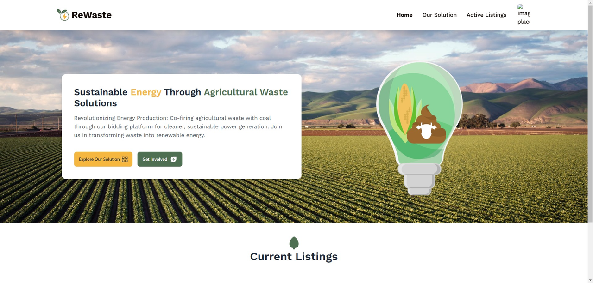

## About ReWaste

ReWaste was an online auction platform connecting agricultural waste sellers (farmers with coconut waste, palm oil biomass, etc.) with power plant owners. The auction model let plant owners bid for biomass at lower-than-coal prices and let farmers monetize previously unused waste — with co-firing as the downstream emissions story.

## Reflections

The biggest lesson was the cost of skipping the design phase. We jumped into implementation without enough planning — no use cases, no activity diagrams — and the lack of structure slowed us down throughout. The participatory award reflected the team's effort but not the quality of execution; if we had front-loaded design, the result would have been different. It pushed me back toward the systems-analysis fundamentals I'd been treating as optional.
