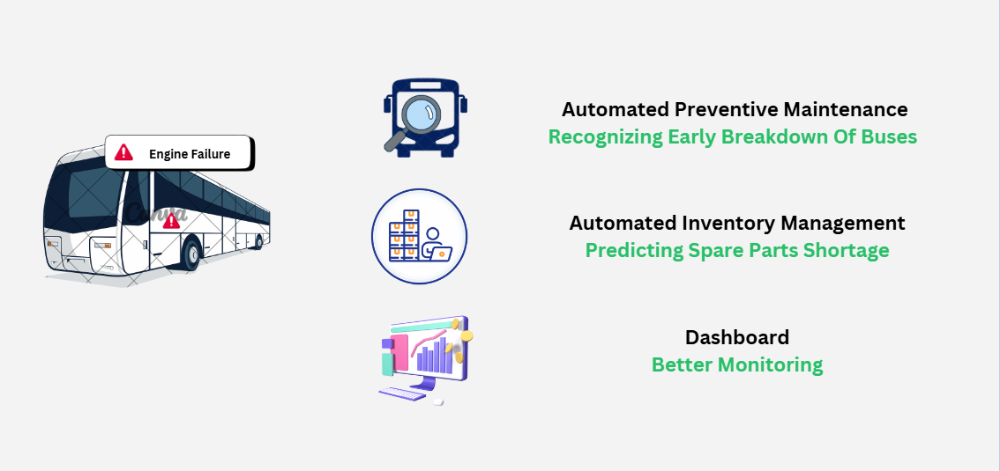
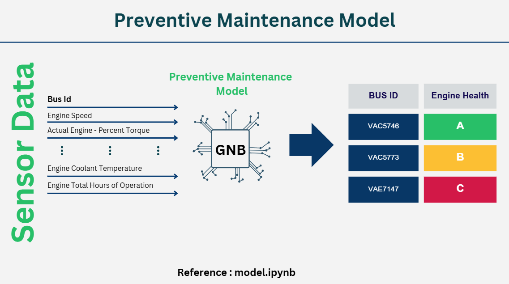

## About MaintainIQ

MaintainIQ is a smart maintenance management system designed to predict and prevent bus breakdowns using AI. The system analyzes data collected from bus sensors to forecast engine health and optimize spare parts inventory. The project aims to help improve operational efficiency by identifying potential failures before they occur, reducing downtime and costs.

## My Contribution

I contributed remotely by focusing on the data analysis and AI model development for the MaintainIQ project. I started by preprocessing large datasets from MyRapid, including Canbus and engine repair data. I filtered the data to focus on MRT feeder buses and extracted the relevant data for 2023. I then analyzed maintenance patterns and identified key metrics like the average number of maintenance entries per bus and the percentage of buses waiting for spare parts. I used the Naive Bayes model for the predictive model, as it was well-suited for the small dataset and the categorization of engine health into discrete labels. After preparing the data, I trained the model to forecast potential engine health issues based on historical data. This predictive model forms the core of MaintainIQ, enabling proactive maintenance decisions.

## Steps Taken in Data Analysis

To build a robust predictive model, I followed a structured approach to data analysis. First, I focused on Canbus and engine repair data, filtering it to include only MRT feeder buses and data from 2023. I then created a CSV file with unique VEH_IDs for MRT feeder buses and filtered the engine repair data to match. Next, I analyzed the data to calculate the average number of maintenance entries per bus (8 times per month) and discovered that 25.3% of buses were waiting for spare parts. I also calculated the time difference between normal maintenance and buses waiting for parts, which averaged 12 days. With the data prepared, I applied a Naive Bayes model to predict engine health based on this historical data.

## Looking Ahead

This hackathon experience has given us valuable insights into how data-driven solutions can improve the transportation sector. The predictive maintenance model can significantly reduce downtime and improve efficiency for bus fleets.
