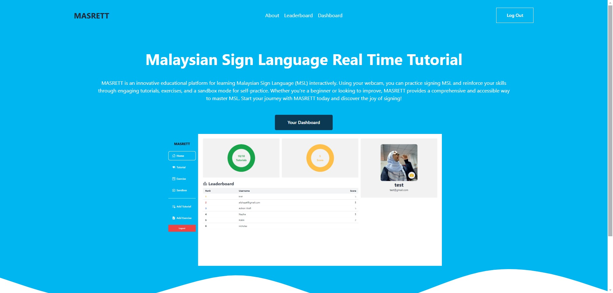
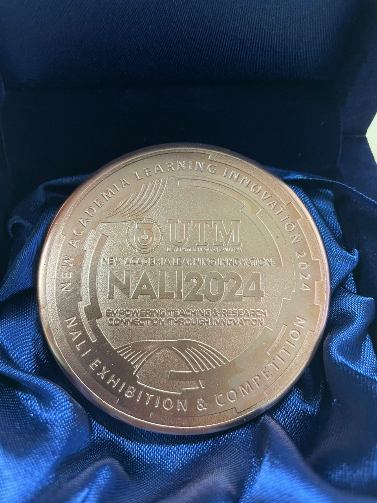

## About MASRETT

MASRETT is designed to allow users to practice MSL using their webcams, providing real-time feedback on their signs. The platform includes features like progress tracking, quizzes, and a sandbox mode where learners can practice at their own pace. While the project is still in its early stages, our demo highlighted what’s to come: a powerful tool for MSL learning that integrates AI and real-time technology. The primary focus of our demo was the real-time model implementation, which tracks user progress and gives feedback as they practice.

## Technical Contributions

[Adnan Shafi](https://www.linkedin.com/in/adnan-shafi1/) and I contributed remotely to MASRETT, focusing on the technical side of things. Our responsibilities included developing the web platform using the MERN stack (MongoDB, Express.js, React, Node.js) and implementing the real-time sign language detection model. The integration of this AI-powered model was one of the most exciting parts of the project, as it allowed us to give users immediate feedback on their sign language skills. Although the real-time detection system isn’t fully complete, the demo provided a glimpse into the potential of what we’re building.

## MASRETT Web Platform Demo

## Future Plans

The project isn’t finished yet—there’s still a lot of work to be done before MASRETT is ready for full release. While we’ve successfully implemented features like progress tracking and real-time sign language feedback, we plan to expand the platform with more interactive elements, better model accuracy, and enhanced user engagement. Our team, including [Toya Lazmin Khan](https://www.linkedin.com/in/toya-lazmi-khan-470a98219/), [Nicholas Pang Jia Chern](https://eportfolio.utm.my/user/nicholas-pang-jia-chern), [Nazihah Surati](https://www.linkedin.com/in/nazihah-surati-7b2069271/), and our supervisor, [Dr. Yusliza Yusoff](https://www.linkedin.com/in/yusliza/), is committed to completing MASRETT and turning it into a fully functional platform for learning MSL.

## Recognition at NALI 2024

At NALI 2024, the bronze medal we received wasn’t just a recognition of our work—it was a reminder of the impact that this project could have on the community. MASRETT is still a work in progress, but the feedback and interest we received at the event have only motivated us to finish the project and make it as accessible and user-friendly as possible. I’m looking forward to what comes next and can’t wait to see how MASRETT evolves in the future.

## Bronze Medal Award

Working on MASRETT has been a challenging yet deeply meaningful experience for me. Presenting it at NALI 2024 felt like a milestone—not because of the award, but because it was a chance to show people something our team truly believes in. Hearing firsthand how MASRETT could help people in the deaf and hard-of-hearing community reminded me why we started this project. There’s still a lot to do, and some days are tough, but seeing the positive response motivates me to keep going. I’m looking forward to building on this momentum and bringing MASRETT closer to a platform that can make a real difference.
