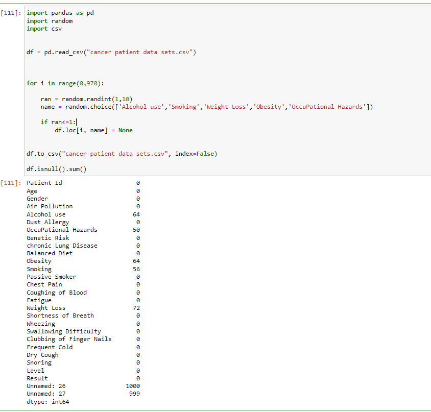

**Code:** [GitHub](https://github.com/ShakeefAhmedRakin/lung-cancer-prediction)

## Overview

Built as part of BRAC University’s CSE422 (Artificial Intelligence) course, this project uses supervised machine learning to predict lung cancer risk. The dataset contains 1,000 patient records with various features such as age, air pollution exposure, smoking habits, and more. The project demonstrates hands-on experience in data preprocessing, feature selection, model training, and evaluation using standard ML pipelines.

## Dataset

The dataset includes the following features:

- **Demographics**: Patient ID, Age, Gender
- **Health & Lifestyle**: Smoking, Alcohol use, Balanced diet, Obesity, Chronic lung disease
- **Environmental Exposure**: Air pollution, Dust allergy, Occupational hazards, Passive smoking
- **Symptoms**: Chest pain, Fatigue, Shortness of breath, Wheezing, Frequent colds, Dry cough
- **Indicators**: Coughing of blood, Weight loss, Nail clubbing, Snoring
- **Target Variables**:

  - **Level**: Class of lung cancer risk
  - **Result**: Final prediction output

## Data Preprocessing

- Introduced artificial `NULL` values and duplicate columns to simulate real-world dirty data.
- Handled missing data using mean imputation (`sklearn.impute.SimpleImputer`).
- Encoded categorical features (e.g., Gender, Level).
- Dropped low-correlation features like Genetic Risk and Occupational Hazards.
- Scaled data using `MinMaxScaler`.
- Created both scaled and unscaled versions of the dataset.
- Performed an 75/25 train-test split.

## Models Used

- Decision Tree
- Naive Bayes
- Random Forest
- Support Vector Machine
- Grid Search for hyperparameter tuning

### Evaluation Metrics

- Accuracy, Precision, Recall, F1-score, Support
- Confusion matrices visualized using Seaborn heatmaps

## Key Learnings

- Learned end-to-end machine learning workflow
- Applied real-world data cleaning and feature selection
- Gained experience in model tuning and evaluation
- Improved skills in visualizing model performance and dataset correlations

## Citations

- Dataset sourced from [Kaggle: Lung Cancer Dataset](https://www.kaggle.com/datasets)
