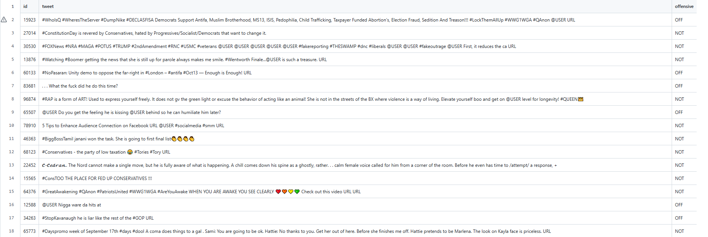
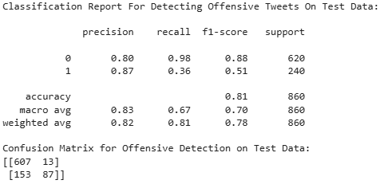
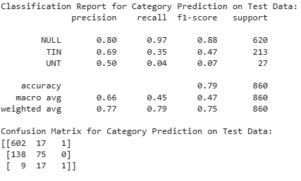

**Code:** [GitHub](https://github.com/ShakeefAhmedRakin/Offensive-Tweet-Classifier)

## Introduction & Purpose

This project focuses on building a machine learning model to classify tweets as offensive or non-offensive and categorize offensive tweets into specific types. The goal is to create a model that can identify offensive content on social media platforms and categorize it.

## Dataset

The dataset used is the Offensive Language Identification Dataset (OLID) v1.0, introduced in "Predicting the Type and Target of Offensive Posts in Social Media" by Zampieri et al. (2019). It contains multiple classification levels: Level A (Offensive vs. Not Offensive), Level B (Targeted Insults vs. Untargeted), and Level C (Target type: Individual, Group, Other).

## Text Preprocessing

- Dropped the 'id' column to remove unnecessary data.
- Handled missing values by filling NULLs in the category column and removing rows with missing tweet values.
- Converted all text to lowercase.
- Removed '@user' mentions.
- Eliminated non-alphanumeric characters and symbols.
- Tokenized text into words using NLTK's word_tokenize().
- Applied lemmatization using NLTK's WordNetLemmatizer.

## Feature Extraction

- Utilized TfidfVectorizer from sklearn to convert preprocessed text into numerical feature vectors.
- Applied a trained TF-IDF vectorizer to transform new text data for model input.

## Model Training

- Implemented Logistic Regression for classification tasks.
- Trained two separate models: one for offensive detection and another for category detection.
- Configured Logistic Regression with max_iter=1000 to ensure convergence.

## Model Evaluation

- Used classification reports to analyze precision, recall, and F1-score for each class.
- Generated confusion matrices to evaluate model performance on test data.
- Examined true positives, true negatives, false positives, and false negatives to assess classification accuracy.

## Stack

Pandas, Scikit-Learn, NLTK, TF-IDF Vectorizer, Logistic Regression

## References

- Zampieri, M., Malmasi, S., Nakov, P., Rosenthal, S., Farra, N., & Kumar, R. (2019). Predicting the Type and Target of Offensive Posts in Social Media. Proceedings of NAACL.
- Zampieri, M., Malmasi, S., Nakov, P., Rosenthal, S., Farra, N., & Kumar, R. (2019). SemEval-2019 Task 6: Identifying and Categorizing Offensive Language in Social Media (OffensEval). Proceedings of The 13th International Workshop on Semantic Evaluation (SemEval).
