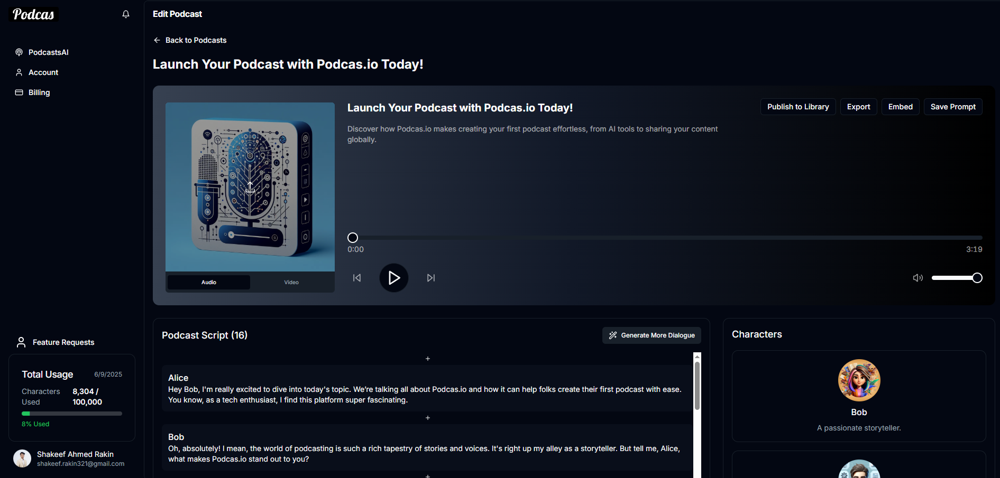

## My Role & Tech Stack

I work as a Full Stack Engineer on Podcas.io, where I develop and maintain features using **Next.js**, **Supabase**, **PostgreSQL**, and **ShadCN UI**. My focus is on delivering a smooth, intuitive user experience for podcast creators.

## How to Create Your Podcast on Podcas.io

Creating your first podcast is easier than ever with Podcas.io. This platform leverages AI technology to help you generate professional-quality podcasts quickly and effortlessly. Follow these simple steps to start your podcasting journey today.

## Step 1: Create an Account

Begin by visiting [Podcas.io](https://podcas.io/) and clicking the **Sign In** button. If you’re new, choose **Sign Up** to create your account—signing up with your Google account makes it quick and hassle-free. No credit card is required upfront. Once registered, you’ll get free access to 5,000 characters per month along with three unique voice options.

## Step 2: Craft Your Podcast Topic

After logging in, select **Create a Podcast** from your profile under **PodcastsAI**. You’ll need to provide some details to guide the AI:

- The main theme or purpose of your podcast
- An optional website URL for additional context or article-to-podcast conversion
- A prompt with specific points, such as characters involved, discussion topics, and relevant context

This step helps tailor the podcast to your vision and ensures content quality.

## Step 3: Decide Your Podcast Hosts

Choose your podcast hosts by selecting from available voices and defining their personas. Free users can pick from three voices, while Starter and Pro plans unlock access to over 1,000 voice options. You can give your hosts names, define their roles, and specify whether they are regular hosts or guest experts.

## Step 4: Click Generate

Once your setup is complete, click **Review & Generate** and let Podcas.io’s AI create your podcast episode. The process is fast, delivering results within moments.

## Step 5: Refine and Share

You can edit the generated script directly within the platform to add more dialogue or fine-tune the content. After regenerating the improved version, your podcast is ready to share. Download it in audio or video format, use the automatically generated professional thumbnails, or embed it easily on your website and social media channels.

## Why Podcas.io?

Podcas.io transforms podcast creation with AI-driven tools that simplify the entire process. From customizable voices and personas to seamless publishing and sharing options, it empowers creators of all skill levels to produce engaging content quickly and professionally.
