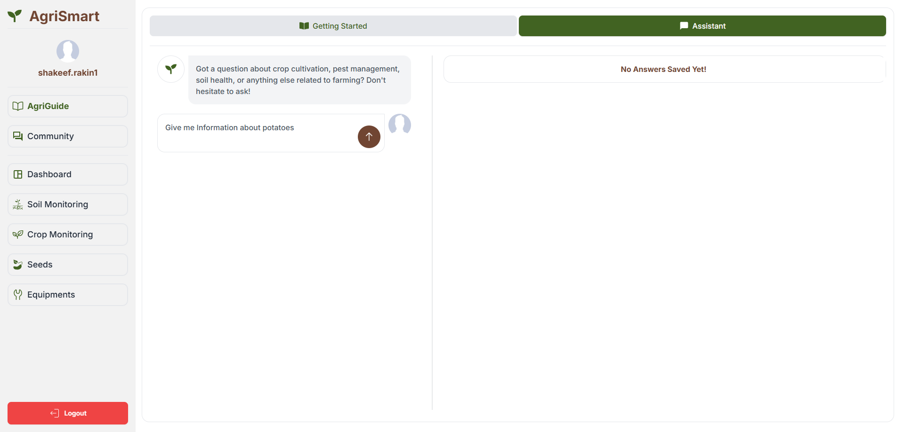
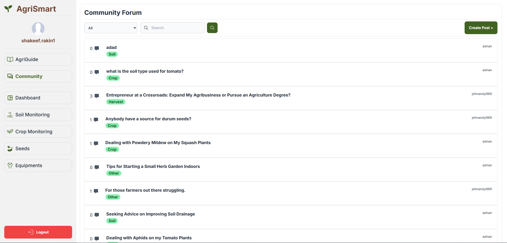
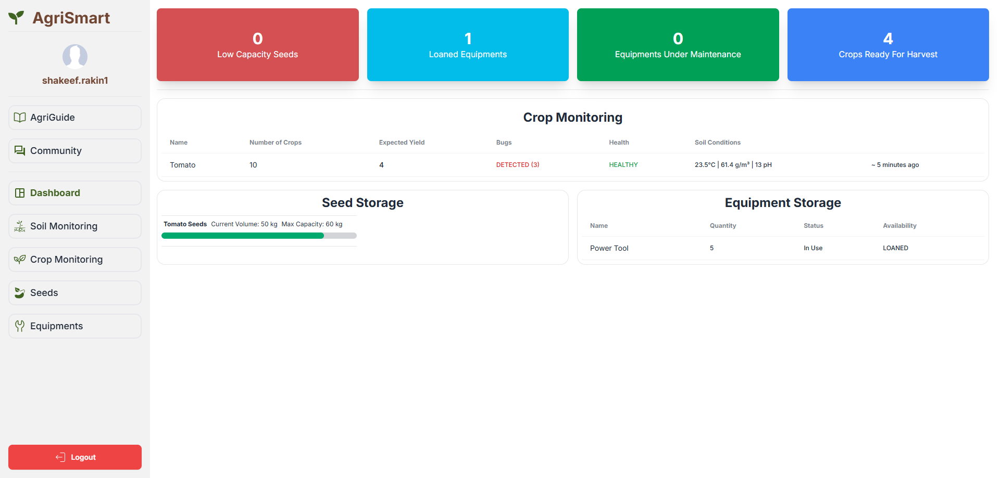
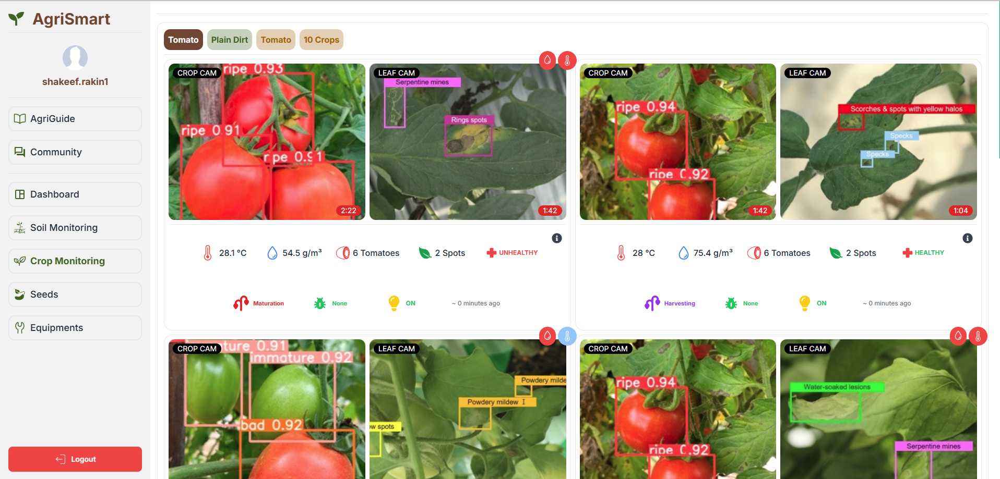

**Live:** [View Website](https://agrismart-a3c49.web.app)
**Code:** [Frontend](https://github.com/ShakeefAhmedRakin/AgriSmart-frontend) | [Backend](https://github.com/ShakeefAhmedRakin/AgriSmart-backend)

## Introduction & Purpose

AgriSmart was developed for a hackathon to showcase how AI and modern web technologies can assist farmers in managing their resources and knowledge. It includes a Gemini-powered AI chatbot, a farm dashboard, a forum, and a scalable backend. Though the IoT integrations were conceptual, the demo illustrated how sensors and cameras could enhance farming efficiency.

## AI-Powered Farming Assistance

An integrated Gemini AI assistant answers farming-related questions via a chat interface. It uses RESTful API calls and handles interactions with efficient state management on the frontend.

Highlights:

- Gemini AI for natural language query resolution
- React-managed input and output flow
- API endpoints for streamlined chat functionality

## Community Forum & Knowledge Sharing

Farmers can ask questions, share knowledge, and engage through a forum built with MongoDB and Express. Firebase manages secure authentication, and React Query ensures real-time interactions.

Key features:

- Forum threads and replies stored in MongoDB
- Firebase Auth with Google and email support
- Smooth UX through data caching and invalidation

## Farm Management Dashboard

The dashboard displays seed inventory, equipment status, and crop/soil health stats. It’s built with a responsive UI and interacts with the backend for CRUD operations.

Core elements:

- Tailwind CSS + DaisyUI for responsive design
- React Router and Hook Form for navigation and validation
- Express routes to manage resource data

## Smart Farming Integrations

While physical sensors weren’t implemented, the architecture was designed for real-time smart farming. The UI visualizes how sensor feeds could inform soil and crop health tracking.

Planned capabilities:

- WebSocket-based data streaming
- Sensor data hooks and charting
- Ready for machine learning model expansion

## Why AgriSmart?

AgriSmart merges AI, community, and dashboard utilities into a unified tool for modern agriculture. Its architecture is prepared for future expansion into real-time IoT and predictive analytics.

Strengths:

- Gemini AI for accessible farming help
- Scalable backend with RESTful design
- Responsive, mobile-ready UI
- Secure login with Firebase
- Concept-ready IoT integration

## Tech Stack

**Frontend**

React.js, Vite, Tailwind CSS, DaisyUI, React Router DOM, React Hook Form, TanStack React Query, Firebase

**Backend**

Node.js, Express.js, MongoDB, Axios, Cors, Dotenv, Nodemon, Gemini AI

**Deployment**

Vercel (Backend), Firebase Hosting (Frontend + Auth)
