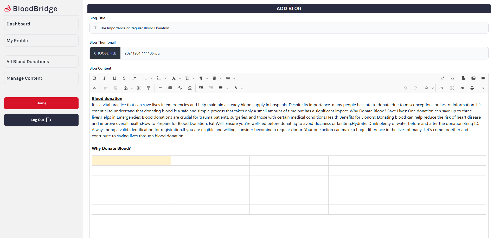

**Live:** [View Website](https://bloodbridge-140aa.web.app/)
**Code:** [Frontend](https://github.com/ShakeefAhmedRakin/BloodBridge-Client) | [Backend](https://github.com/ShakeefAhmedRakin/BloodBridge-Server)

## Key Features

**Roles and Permissions**

- **Admin:** Full access to user, donation, and content management.
- **Volunteer:** Limited access to manage donation statuses and view analytics.
- **Donor:** Can create and manage donation requests and profiles.

**Dashboards**

- **Admin Dashboard:** User management, role assignment, donation request and blog oversight.
- **Volunteer Dashboard:** View/edit donation requests, monitor platform stats.
- **Donor Dashboard:** Submit, edit, or delete donation requests; manage profile.

**Public Pages**

- **Search & Requests:** Browse/filter donors and pending donation requests.
- **Funding:** Secure donations via Stripe.
- **Blog:** Rich-text editor with support for media, accessible by admins and volunteers.

**Security & UX**

- Firebase authentication, JWT-based route protection.
- Fully responsive layout across devices.
- Secure Stripe integration for funding donations.

## Tech Stack

**Frontend:**
React.js, Tailwind CSS, DaisyUI, MUI, Flowbite, TanStack Query, Axios, React Hook Form, Stripe.js, Jodit React, SweetAlert2, AOS, React Helmet, etc.

**Backend:**
Node.js, Express.js, MongoDB, Mongoose, JWT, Stripe API

**Deployment:**
Firebase Hosting, Vercel

## Screenshots

### Register Page

Users can register with personal details, upload profile images, and select location and blood group.

### Landing Page

Clear navigation to blogs, requests, and funding. Role-based dashboard access post-login.

### Donor Dashboard

Manage profile and donation requests with ease.

### Volunteer Dashboard

Access request data and platform stats.

### Admin Dashboard

User management, blog publishing, and request moderation tools.

### Rich-Text Blog Editor

Markdown-style editor with image support and formatting options.

### Responsive Design

Optimized for all screen sizes and devices.

## Conclusion

This project offered practical experience in full-stack development, from secure auth systems to integrating third-party services like Stripe. It solidified my understanding of building scalable, role-sensitive web applications with real-world use cases.
