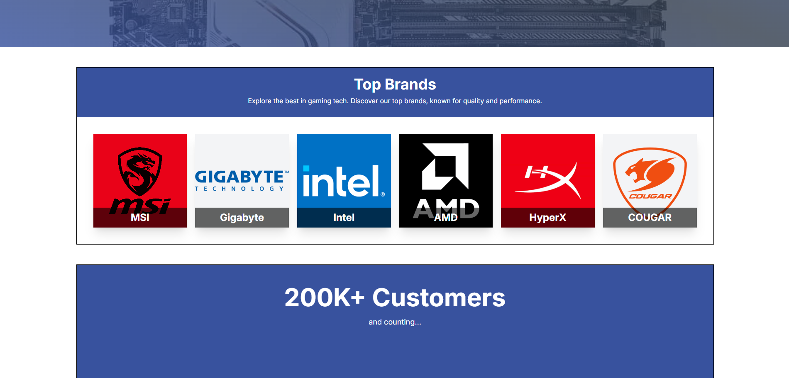
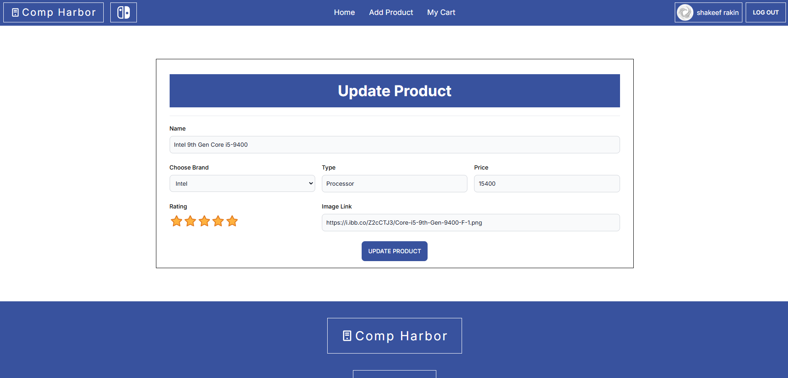
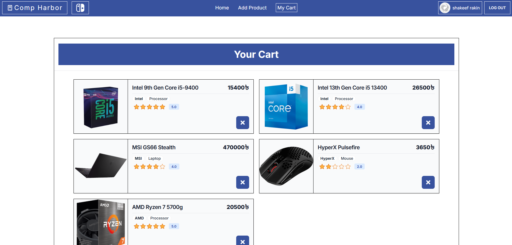
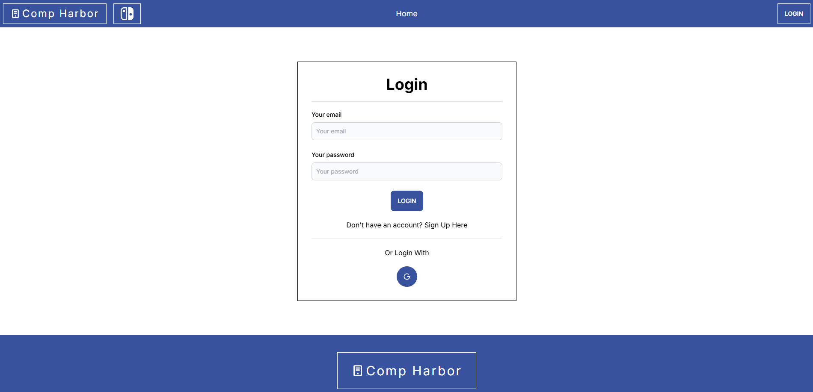

**Live:** [View Website](https://bytebrilliance-5c61e.web.app/)
**Code:** [Frontend](https://github.com/ShakeefAhmedRakin/CompHarbor-client) | [Backend](https://github.com/ShakeefAhmedRakin/CompHarbor-server)

## Introduction & Purpose

Comp Harbor is a tech-oriented e-commerce platform developed to enhance practical skills in full-stack development using the MERN stack. It includes secure authentication, product management, and real-time user cart functionalities, with a strong focus on responsive design and data synchronization across the system.

## Brand-Centric Product Display

The homepage displays featured brands with associated products. MongoDB structures product-brand relationships, while React manages dynamic state rendering.

## Product Management System

Users can add or update products through private routes. The backend (Node.js + Express) validates inputs and stores product data in MongoDB, ensuring accurate real-time UI updates.

- Real-time product listing refresh after add/update
- Backend handles CRUD operations with input validation
- Data is fetched dynamically using React Router and component state

## Cart System with User-Specific Data

Each user has a dedicated cart. Actions like add/remove are reflected immediately across the UI using efficient MongoDB queries and React state updates.

## Authentication and Security

Firebase authentication supports both email/password and Google login. Error states are handled with form validations and toast notifications for smoother UX.

## Responsive UI and Theming

Tailwind CSS and DaisyUI enable a responsive layout. A dark/light theme toggle enhances user experience, dynamically controlled through React state and Tailwind’s `dark` class.

## Why Comp Harbor?

Comp Harbor stands out with:

- Brand-focused product browsing
- Secure Firebase-based login
- Realtime cart sync per user
- Responsive UI with dark mode
- Structured MERN backend

## Tech Stack

**Frontend**

React.js, Tailwind CSS, DaisyUI, React Router, Firebase, Sonner, React Icons, SwiperJS, react-rating

**Backend**

Node.js, Express.js, MongoDB

**Deployment**

Vercel, Firebase Hosting
