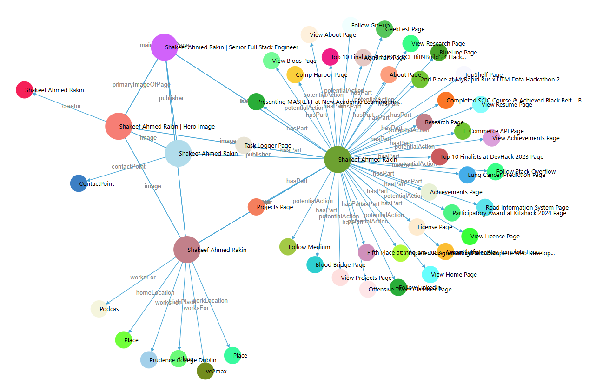

**Live:** [shakeefahmedrakin.vercel.app](https://shakeefahmedrakin.vercel.app/)
**Code:** [GitHub](https://github.com/ShakeefAhmedRakin/portfolioNextJS)

## Overview

This portfolio is intentionally over-designed. Not in the visual sense, but in the architectural sense: it is a meta-engineering exercise where the goal was to build a content and metadata graph so tightly wired that the site is effectively zero-maintenance once the system is in place. Every project, achievement, paper, work entry, and bio fact is the input to a planned pipeline that fans out into the UI, SEO surface, structured data, and OG layer with no hand syncing in between.

## A Single Source of Truth, Everywhere

The defining property of this codebase is propagation. There is exactly one place to change any given fact, and that change shows up in every layer of the site automatically:

- Update a tagline in `content/site-config.ts` and the home hero, footer, page titles, meta descriptions, JSON-LD `Person`, `Website`, and `Organization` schemas all reflect it on the next build.
- Add a new project as an MDX file under `content/projects/{category}/{slug}/index.mdx` and the projects listing, the dynamic `[slug]` route, the sitemap, the breadcrumb trail, the JSON-LD `TechArticle` schema, and the page level Open Graph image are all generated for it without any other edit.
- Bump a work entry's end date in its frontmatter and the about page timeline, the home experience section, the `Person.worksFor` schema, and the `knowsAbout` keyword set update from the same input.
- Toggle `isFeatured` on a project and the home grid, the OG-driven sharing card, and the schema all react to it.

There are no duplicate copies of project titles, no static OG dumps committed to the repo, no manually edited sitemaps, no hand-rolled JSON-LD blocks. The system was designed to make those things impossible to drift.

## Type-Safe Content Pipeline

Content lives as MDX in `content/`, processed by **Velite** into schema-validated typed collections that the App Router imports directly:

- **Projects** under `content/projects/{category}/{slug}/index.mdx`
- **Achievements** under `content/achievements/{slug}/index.mdx`
- **Research** under `content/research/{slug}/index.mdx`
- **Work Experiences** under `content/workExperience/{slug}/index.mdx`

Frontmatter is validated against a typed schema, MDX is compiled at build time, images automatically get blur data URLs, and consumers get fully typed imports. No runtime CMS, no fetch on render, no headless CMS overhead. Adding content is a typed file write, not a content management workflow.

## SEO and Structured Data Graph

The metadata layer is the most engineered part of the site. JSON-LD is composed from shared primitives (`Person`, `Organization`, `Website`, `BreadcrumbList`, `ImageObject`) and assembled per page type into a connected graph using `@id` references, so every page contributes nodes that link back into a coherent entity model rather than living as isolated blobs.

What that buys:

- Per-page-type schemas (`Person`, `Organization`, `Website`, `BreadcrumbList`, `TechArticle`, `BlogPosting`, `ImageObject`) composed from shared primitives in `metadata/shared/`.
- Schema generators for projects, achievements, and research that derive structured data directly from MDX frontmatter and the compiled content.
- Type-safe schema authoring via `schema-dts`, so a missing or wrong field is a compile error.
- Automatic breadcrumb schema tied to the App Router segment structure.
- Dynamic sitemap and `robots.txt` generation using Next.js conventions, keyed off the same Velite collections.

The result is that the site's structured-data graph is a side effect of the content, not a parallel artifact.

## Dynamic Open Graph Images

A custom `/api/og` route on the Edge runtime produces page-specific OG images on demand. Each page passes a title and subtitle derived from the same MDX frontmatter or `site-config.ts`, and the generator composes the hero portrait, dotted-grid overlay, and embedded font into a single image response. No design tool round trip, no static OG dump committed to the repo, and no chance of an OG image drifting out of sync with the page it represents.

## Styling and Animation as a System

Even the visual layer is built as a system rather than a per-page treatment:

- Tailwind CSS v4 with `@theme inline` driven entirely from CSS custom properties in `globals.css`. There is no `tailwind.config.ts`. Theme tokens are the source of truth.
- OKLCH color space across the entire palette, dark-mode only by design.
- Custom Spotlight component with dual Motion animations and configurable HSLA gradients.
- Intersection-observer driven scroll animations via `tailwindcss-intersect`, with shared animation constants reused across sections so motion stays consistent without per-section tweaking.
- Typography system, `cn()` helper, CVA badge and button variants, and a small set of layout wrappers built in the shadcn/ui style.

## Blog Integration

The home page surfaces my Medium articles through an RSS pipeline rather than a duplicated CMS. The `Article` type is defined locally and rendered through a dedicated blog grid, so my Medium publishing stays the canonical source and the portfolio reflects it without re-authoring.

## Tech Stack

| Layer         | Technologies                                                         |
| ------------- | -------------------------------------------------------------------- |
| **Framework** | Next.js 15 (App Router, Turbopack), React 19                         |
| **Language**  | TypeScript 5 with strict mode                                        |
| **Content**   | Velite, MDX, schema-validated frontmatter                            |
| **Styling**   | Tailwind CSS v4, OKLCH theming, shadcn/ui, Motion                    |
| **SEO**       | schema-dts, JSON-LD graph per page type, dynamic OG via Edge runtime |
| **Tooling**   | pnpm, concurrently (Velite watch + Next dev), Prettier               |

## Why It Matters

The point of this project is not the surface design. The point is that the entire site is downstream of a small, typed, planned content and metadata graph. Once that graph is in place, the cost of adding or updating anything trends to zero. There is one place to change a project, one place to change a bio line, one place to add a paper, and the rest of the site, including its SEO and structured data layer, simply re-derives. That is the kind of system I tend to build at work, and the portfolio is the cleanest place to demonstrate it.
