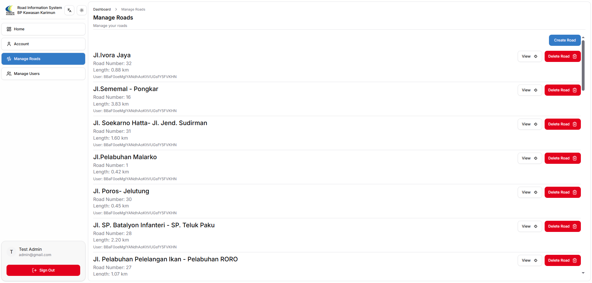
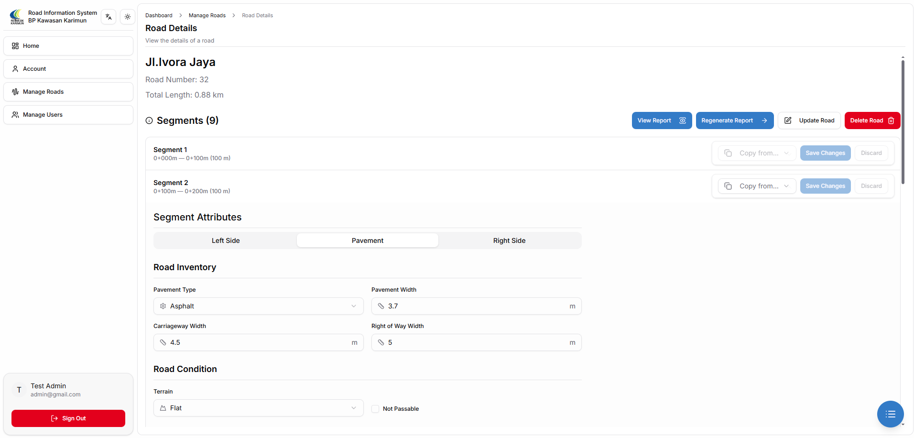
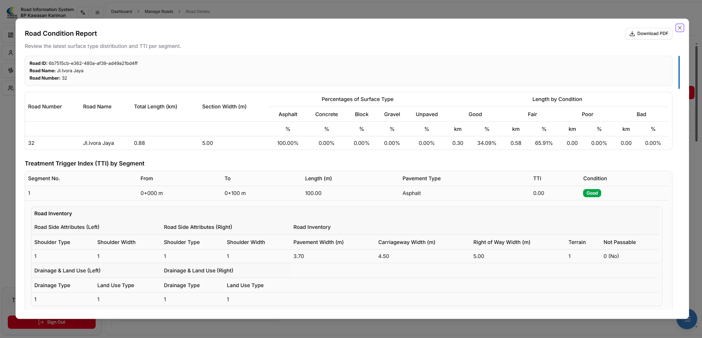
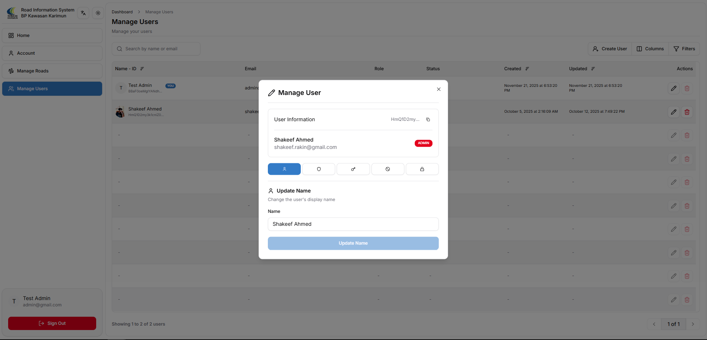

**Live:** [View Website](https://sistem-informasi-jalan-bp-kawasan-karimun.vercel.app/)
**Code:** [GitHub](https://github.com/ShakeefAhmedRakin/Road-Information-System-BP-Kawasan-Karimun)

## Overview

The Road Information System is an internal management platform developed for BP Kawasan Karimun, designed to track and analyze road infrastructure conditions within the industrial area. Built as a monorepo with Turborepo, it provides a full-stack, type-safe solution for road inventory management, pavement condition assessment, and automated reporting based on Indonesia's PKRMS Manual (SE 22/2022) standards.

## Dashboard & Road Overview

The dashboard provides a comprehensive overview of all roads with key metrics including total length, section width, and surface type percentages (Asphalt, Concrete, Block, Gravel, Unpaved). This allows infrastructure managers to quickly assess the state of road inventory at a glance.

## Road Management

Administrators and operators can manage the full lifecycle of road data, including creating, updating, and deleting roads. Each road entry includes details such as road number, total length, and section width. The system supports auto-segment generation based on configurable intervals and generation modes.

## Segment & Pavement Assessment

Each road is divided into segments, and operators can perform detailed pavement condition assessments. The system supports five pavement types — Asphalt, Concrete, Block, Gravel, and Unpaved — each with its own set of damage parameters. For example, asphalt assessments cover 12 parameters including bleeding, disintegration, crack analysis, potholes, rutting, and edge damage.

## TTI Calculation & Reporting

The Treatment Trigger Index (TTI) is automatically calculated based on weighted distress areas per segment. Roads are classified into four condition categories: Good (TTI < 25), Fair (25-50), Poor (50-75), and Bad (TTI >= 75). Comprehensive PDF reports can be generated client-side with road information, segment-by-segment analysis, and condition statistics.

## Role-Based Access & User Management

The system implements three hierarchical roles — Admin, Operator, and Visitor — with granular permissions. Admins have full control over user management including creating accounts, assigning roles, banning/unbanning users, and revoking sessions. Visitors have controlled, view-only access to roads marked as visible. Authentication is handled via Better Auth with session-based security.

## Key Features

- **Road Inventory Management** — Comprehensive road and segment data entry with auto-segment generation
- **Pavement Condition Assessment** — Support for 5 pavement types with detailed damage schemas
- **TTI Calculation Engine** — Automated computation based on PKRMS Manual (SE 22/2022)
- **PDF Report Generation** — Client-side PDF export with road condition reports
- **Role-Based Access Control** — Admin, Operator, and Visitor roles with hierarchical permissions
- **Internationalization** — Multi-language support (English & Indonesian)
- **Dark/Light Theme** — System preference detection with manual toggle
- **Responsive Design** — Mobile-first design optimized for all screen sizes

## Tech Stack

**Frontend**

Next.js, React, TypeScript, Tailwind CSS, shadcn/ui (Radix UI), React Hook Form, Zod, TanStack Query, Motion (Framer Motion), Lucide React, Sonner, next-themes, jsPDF, html2canvas-pro

**Backend**

oRPC, Drizzle ORM, PostgreSQL, Neon Serverless, Better Auth, Zod

**DevOps & Infrastructure**

Turborepo, pnpm, GitHub Actions, Vercel, Neon, TypeScript, Prettier
