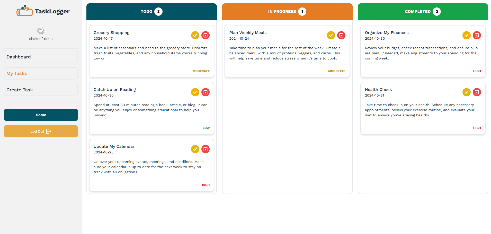

**Live:** [View Website](https://tasklogger-4b2b9.web.app/)
**Code:** [Frontend](https://github.com/ShakeefAhmedRakin/TaskLogger-client) | [Backend](https://github.com/ShakeefAhmedRakin/TaskLogger-server)

## Introduction & Purpose

Task Logger is a productivity-focused task management platform built to organize daily workflows through an interactive interface. It combines the MERN stack with Firebase authentication and drag-and-drop features to allow users to manage tasks smoothly. This project deepened my skills in full-stack development, API structuring, and client-server synchronization.

## Task Management System

Tasks are categorized and can be created, edited, deleted, or reordered using drag-and-drop. The UI updates in real time using React DnD and React state, while all operations sync with MongoDB via secure Express API calls.

Key features:

- Column-based task categorization
- Real-time drag-and-drop between task statuses
- Persistent updates through backend synchronization

## Authentication & Protected Routes

Authentication is implemented with Firebase, supporting both Google and email/password login. Protected routes ensure only logged-in users can access task management features.

- Firebase Auth handles secure login and registration
- React Router DOM protects private routes
- Smooth error handling and feedback via toast notifications

## Backend & API

The backend uses Express and MongoDB to handle CRUD operations. CORS and dotenv are configured for security and environment management. Axios is used for API communication.

- RESTful API for task creation, updates, and deletion
- MongoDB stores tasks and user data
- Express middleware handles validation and routing

## UI & Frontend Implementation

Built with React and Vite, the UI is responsive and clean. Tailwind CSS and DaisyUI are used for styling, while TanStack React Query handles data fetching and caching.

- React Hook Form manages forms with validation
- AOS adds animations for smooth transitions
- Drag-and-drop implemented via React DnD

## Why Task Logger?

Task Logger focuses on real-time task interaction and productivity. Its strengths include:

- Drag-and-drop workflow support
- Firebase-secured authentication
- Scalable REST API with Express
- Clean, responsive UI with dark mode ready

## Tech Stack

**Frontend**

React..js, Vite, Tailwind CSS, DaisyUI, React Router DOM, React DnD, React Hook Form, TanStack React Query

**Backend**

Node.js, Express.js, MongoDB, Axios, Cors, Dotenv

**Deployment**

Vercel (Backend), Firebase Hosting (Frontend + Auth)
