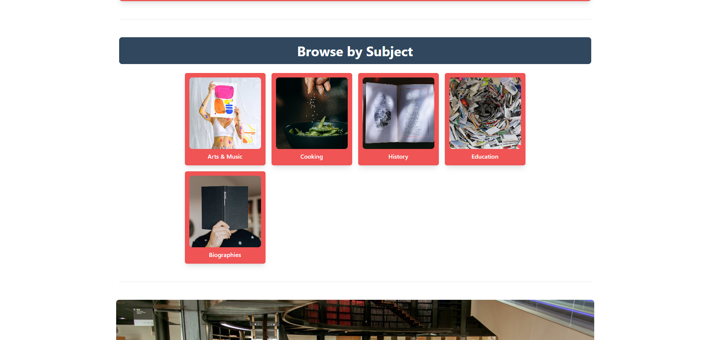
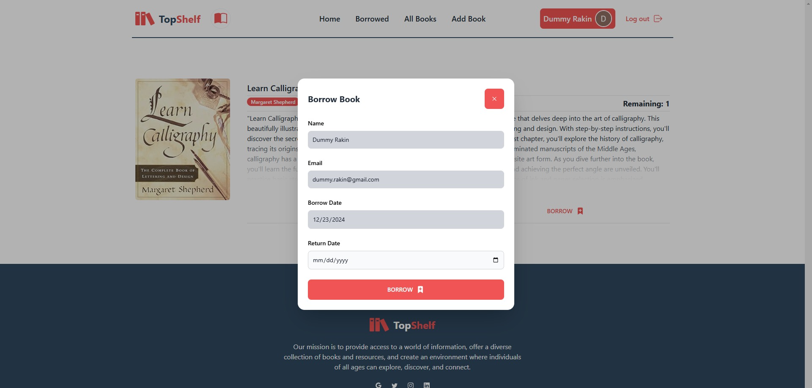
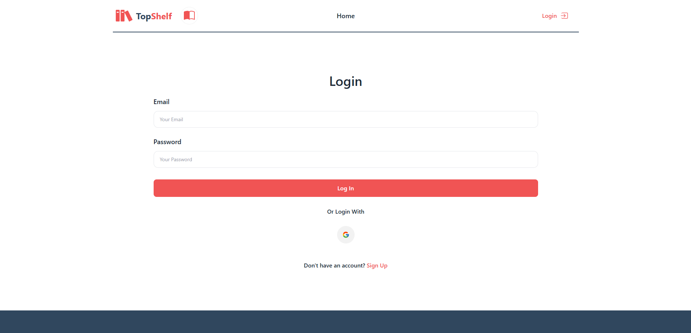
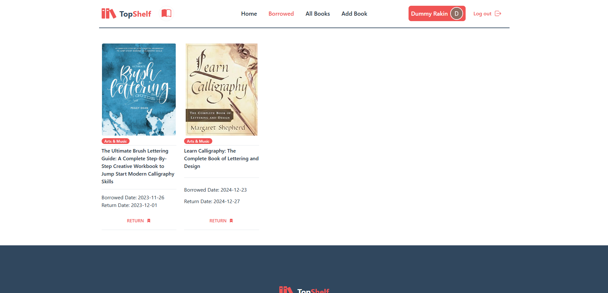

**Live:** [View Website](https://topshelf-79995.web.app/)
**Code:** [Frontend](https://github.com/ShakeefAhmedRakin/TopShelf-client) | [Backend](https://github.com/ShakeefAhmedRakin/TopShelf-server)

## Introduction & Purpose

TopShelf is designed to make library management accessible and efficient. The system allows users to explore books by category, manage borrowings, and access content seamlessly across devices. It also includes features for secure authentication and PDF downloads. This project strengthened my experience across both frontend and backend development.

## Book Categories and Details

Books are organized into categories for easy navigation. Each listing includes detailed information, with options to read or borrow. Real-time availability is handled via backend updates, using MongoDB to track quantities and React for dynamic UI rendering.

## Borrowing and Return System

The borrowing system lets users choose a return date via a modal. Borrowed books are listed with return dates and can be managed in a dedicated page. I implemented this using React state handling and Express routes to update data and reflect accurate availability.

Key interactions:

- Borrowing updates availability in the backend and adds books to the user’s borrowed list.
- The Borrowed Books page displays real-time data such as due dates.
- Returning books updates the status and quantity in MongoDB.

## User Authentication

Authentication is handled through **Firebase**, supporting both email/password and Google login. JWT tokens secure API calls, ensuring that only authenticated users can perform sensitive actions such as borrowing or returning books.

## PDF Download and User-Specific Features

Users can download book pages as PDFs, implemented via frontend libraries for on-demand generation. Each user has a personalized Borrowed Books section that dynamically fetches and filters data based on their session, improving usability and access control.

## Why TopShelf?

TopShelf combines intuitive UX with robust backend systems to create a functional and secure library experience. Key strengths include:

- Real-time book management
- Secure authentication with JWT
- Responsive, mobile-friendly interface
- PDF content download support

## Tech Stack

**Frontend**

React.js, Tailwind CSS, DaisyUI, Flowbite, React Router, Firebase, React Icons, Swiper.js, react-rating, Sonner

**Backend**

Node.js, Express.js, MongoDB, JWT, Axios, CORS, Dotenv

**Deployment**

Vercel, Firebase Hosting
